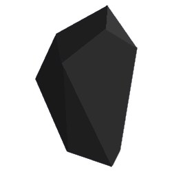

<p align="center">
</p>

# WARNING!

CitrineScript is deprecated, go to these instead.

https://github.com/Devitzer/Obsidian
https://github.com/Devitzer/obpl
https://deno.land/x/obsidianlang
https://deno.land/x/obpl

# Obsidian

The easy one.

# Welcome!

Welcome to Obsidian! Obsidian is a very simple, light and fun language to learn! In this README, I will show you how to get started, and some resources to help you with this language!

## 1. Prerequisites

You need to install [Deno.](https://deno.land/)

## 2. Installation

To run Obsidian files (.ob), you need our runtime CLI, you don't actually need this too, because it comes packaged with the CLI, which is called OBPL (Obsidian Programming Language). So go to the [obpl repo](https://github.com/Devitzer/obpl) to get started.

## 3. Running your files!

The CLI will only run .ob files, and we check this. So make your main.ob file and get started with your coding!

# Why Obsidian?

Because Obsidian isn't close to a high level language yet there isn't really a reason except to support me, I want to be a Software Engineer and supporting any of my projects will help this career path! I will still give you reasons though.

1. Lightweight

Assuming you install the OBPL cli, which is very small (1kb unpacked!!!), this makes OBPL files easy to run. This is possible because I upload the Obsidian base on deno.land/x which means it's on the cloud and you don't have to install it yourself!

2. It's easy!

Obsidian has a very simple syntax.
Here is some examples:

```txt
# Comments are just one hashtag! And they keep going until a new line.
# Also no semicolons, except for special use cases.
# Example:

let x; # Obsidian needs to have this so it knows that this is not just an undefined variable

let x = 5
static y = 5

# Otherwise, they are not needed, see how these words are understandable for both program and also non programmers easily?

static z = x + y # Some math!

io.print(z) # output: 10
sys.sleep(2000) # wait 2 seconds
io.print(z + z) # output: 20
```

I think you get the point.

# Resources

Obsidian Official Documentation: https://obsidian.geodax.ca/

[Here's](./CONTRIBUTING.md) how to contribute.

That's it for now!